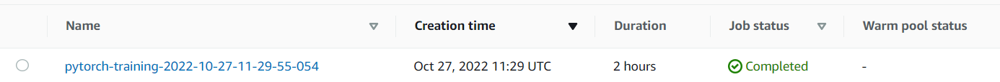
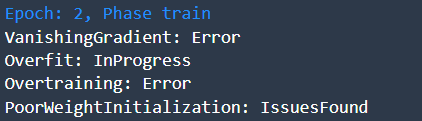

**NOTE:** This file is a template that you can use to create the README for your project. The **TODO** comments below will highlight the information you should be sure to include.

# Image classification using AWS Sagemaker

<!-- **TODO:** Write a short introduction to your project. -->

###### Short Introduction: This project uses RESNET50 with Pytorch framework to classify dog breeds. Given an image of a dog, this algorithm will identify an estimate of the canine’s breed. 

## Dataset

### Overview
<!-- **TODO**: Explain about the data you are using and where you got it from -->
###### Using the link: https://s3-us-west-1.amazonaws.com/udacity-aind/dog-project/dogImages.zip, it was possible to download and unzip the dogImages directory and later send it to S3.

### Access
<!-- **TODO**: Explain how you are accessing the data in AWS and how you uploaded it -->

## Hyperparameter Tuning
<!-- **TODO**: What kind of model did you choose for this experiment and why? Give an overview of the types of parameters and their ranges used for the hyperparameter search -->

###### Used the Resnet50 as from the previous practice it fits for that type of image classification 
###### Changed hyperparameters for learning rate and batch size: "lr": [0.001, 0.1], "batch_size": {16, 32, 64, 128, 256}

<!-- Remember that your README should:
- Include a screenshot of completed training jobs
- Logs metrics during the training process
- Tune at least two hyperparameters
- Retrieve the best best hyperparameters from all your training jobs -->

#### Screenshot for completed training jobs

#### Tune at least two hyperparameters

#### Retrieve the best hyperparameters from all your training jobs
{ 'batch_size': '"128"',
 'lr': '0.024204121354093222',
}

## Debugging and Profiling
<!-- **TODO**: Give an overview of how you performed model debugging and profiling in Sagemaker -->
Used sagemaker debugger that collects the output tensors to analyze the state of a training job. 
Sagemaker debugger's "CollectionConfig" and "DebuggerHookConfig" APIs provide methods for grouping tensors into collections and saving them to a target S3 bucket.  
After creating the debugger config, it is then passed to the estimtor to link it with the hooks of the training and evaludation in the estimator entrypoint

### Results
<!-- **TODO**: What are the results/insights did you get by profiling/debugging your model? -->
After Epoch 2, the STDOUT showed the following:

Profiler output is in the root directory of the repository, named: "profiler_repot.zip"
<!-- **TODO** Remember to provide the profiler html/pdf file in your submission. -->

## Model Deployment
<!-- **TODO**: Give an overview of the deployed model and instructions on how to query the endpoint with a sample input. -->
The endpoint is "ml-c5-2xlarge" which is a quite a big compute one. Used it to check how fast the query will be. The query made is as follows:
1. Taking any image from the dogImages test directory
img_path = "dogImages/test/002.Afghan_hound/Afghan_hound_00141.jpg"
2. Use the predictor.predict method after reading the image in the binary format. Pass the image binaries to the predictor.predict method and wait for the predicted class.

##### Model Endpoint

<!-- **TODO** Remember to provide a screenshot of the deployed active endpoint in Sagemaker. -->
